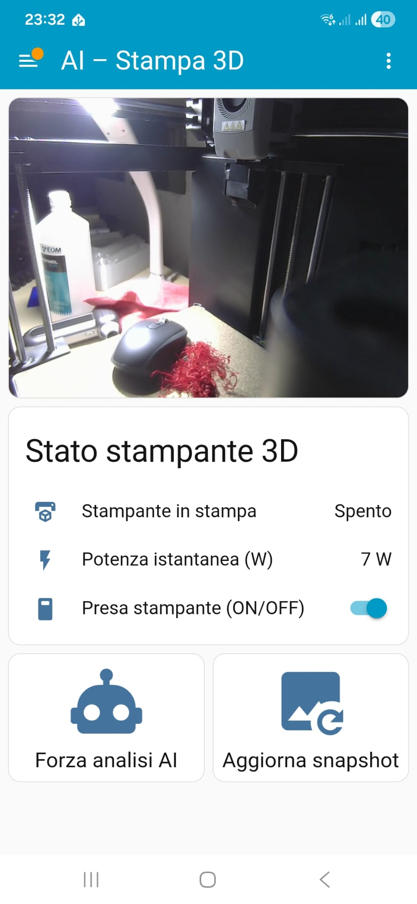
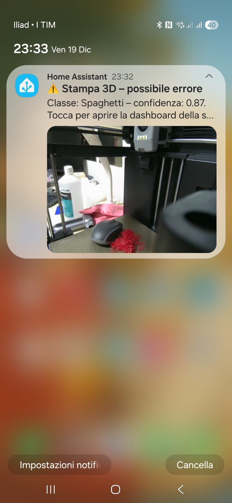
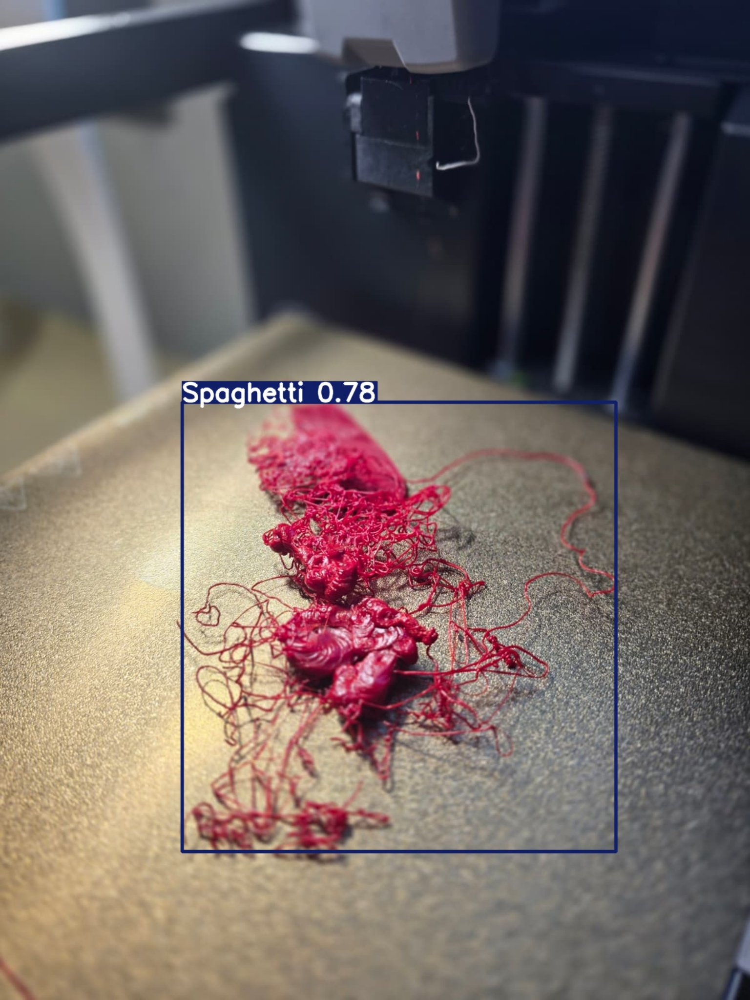
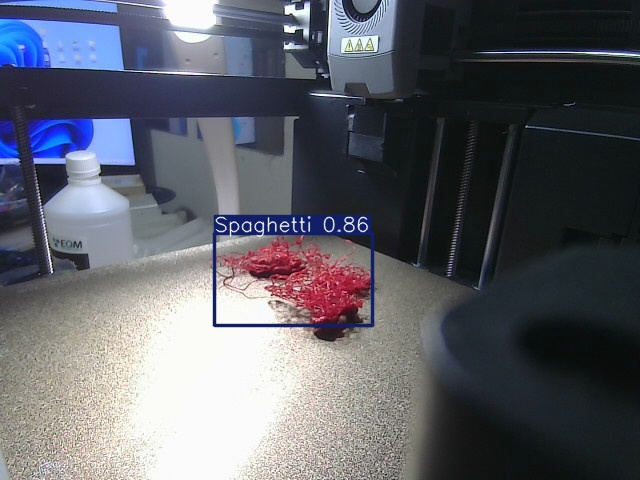

# 🧠 AI-based 3D Print Failure Detection  
### Raspberry Pi + Home Assistant (local, no cloud)

This project provides **local real-time detection of 3D printing failures** using:

- a Raspberry Pi running a small Python AI server
- a YOLO object detection model
- Home Assistant automations + notifications

No cloud services, no external dependencies: **everything stays inside your LAN**.

---

## 🚨 What failures can be detected?

Example failure classes supported by YOLO training:

- spaghetti extrusion
- detached layers
- bed detachment
- stringing/abnormal filament behavior

More classes can be added by retraining the model.

---

# 📸 Demo – screenshots reali

## Dashboard Home Assistant



---

## Notifica push con alert AI



---

## YOLO rileva spaghetti – bounding box




---

## 🔧 System Architecture (overview)

Webcam → Raspberry Pi AI Server → Webhook → Home Assistant → Notification


### Components:

1. A webcam streaming MJPEG of the printer  
2. Raspberry Pi running:
   - Python AI server (`/check` endpoint)
   - YOLO inference using a custom `best.pt`
   - sends webhook when detection occurs  
3. Home Assistant:
   - polls the AI endpoint
   - checks if printer is printing (power sensor)
   - copies AI snapshot to `/config/www/ai_3d/ultima.jpg`
   - sends persistent + mobile notification

---

## 📦 Repository Contents
```
AI_3D_FailDetect_Raspberry_HA/
├ app/ # Flask server + YOLO logic
├ assets/ # images used for docs/examples
├ config.yaml # AI configuration
├ HOW_TO_TRAIN_MODEL.md
├ HOW_TO_TRAIN_MODEL_ita.md
├ README.md # full project documentation
├ README_ita.md
├ requirements.txt
├ run_server.sh
├ setup.sh
```

---
 
## Add your trained YOLO weights here:

`AI_3D_FailDetect_Raspberry_HA/model/best.pt`


⚠️ Model weights (`best.pt`) are intentionally excluded for license reasons. 

---

## 🚀 Quick Installation

(On Raspberry Pi)

```
scp -r AI_3D_FailDetect_Raspberry_HA pi@<RASPBERRY_IP>:/home/pi/

ssh pi@<RASPBERRY_IP>
cd ~/AI_3D_FailDetect_Raspberry_HA
chmod +x setup.sh
./setup.sh
./run_server.sh
```

---

## 📡 Home Assistant Integration

The Raspberry server exposes:
```
/check       → JSON inference response
/ultima.jpg  → last captured frame
```

Home Assistant calls ```/check``` periodically and receives detection webhooks.

Full HA package available here:

[Full HA integration](./AI_3D_FailDetect_Raspberry_HA/README.md)

---

## 🧪 Training your own detection model

Instructions available in:

  - ```HOW_TO_TRAIN_MODEL.md```
  - ```HOW_TO_TRAIN_MODEL_ita.md```

Datasets from Roboflow or custom annotated frames are supported.

---

## 📋 Requirements

  - Raspberry Pi 3/4/5 recommended
  - Python 3.10+
  - Home Assistant Core/OS
  - Smart plug with power monitoring
  - IP webcam exposing MJPEG stream

---

## 🛡️ Privacy & Local Processing

This project was designed for **maximum privacy**:

  - video never leaves the local network
  - real-time inference runs only on Raspberry Pi
  - no cloud API keys
  - no proprietary services required

---

## 🤝 Contributing

Contributions are welcome!

  - submit issues and suggestions
  - PRs for improved models / configs
  - share training datasets if license allows

---

## 📄 License

Released under the **MIT License**.
See LICENSE file.


---

## ⭐ Why this project?

Because 3D printers fail silently.
Spaghetti prints waste filament, damage printers, and can be dangerous.

This project alerts you locally, without cloud dependence.

If you'd like help integrating with automations or expanding AI classes, open an Issue.
